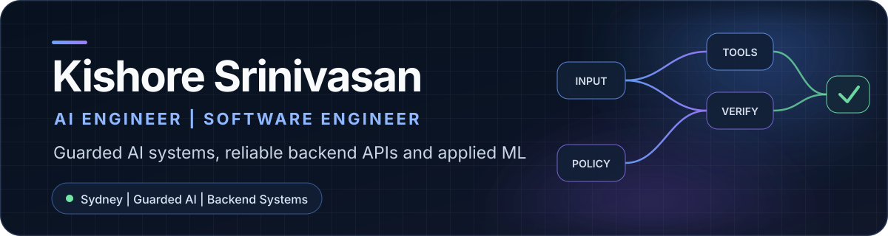

  

  
  
  

I build AI and software systems that make operational work more reliable, inspectable and safe. My work sits where backend engineering, applied AI, data and product delivery meet.

I am completing a **Master of Computer Science (Advanced Entry)** at the University of Sydney in November 2026.

## What I build

- **Guarded agentic systems** with bounded tools, inspectable evidence and human review.
- **Backend services and data workflows** using Python, FastAPI, SQL and PostgreSQL.
- **Applied ML systems** with explicit evaluation, failure analysis and operational boundaries.

## Selected engineering work

<table>
  <tr>
    <td valign="top">
      <h3><a href="https://github.com/SkinnyFatBoy05/opsgraph-copilot">OpsGraph Copilot</a></h3>
      
Production-style AI engineering platform for RAG, guarded read-only SQL, bounded LangGraph agents, evidence verification and human review.

      
<strong>Evidence:</strong> 114 backend tests, 9 frontend tests, 5 browser workflows and 40/40 deterministic evaluations of routing, tool safety and evidence integrity. This is not a live-model accuracy claim.

      
<code>Python</code> <code>FastAPI</code> <code>LangGraph</code> <code>React</code> <code>PostgreSQL</code>

    </td>
  </tr>
  <tr>
    <td valign="top">
      <h3><a href="https://github.com/SkinnyFatBoy05/gridbridge">GridBridge</a></h3>
      
Synthetic utility-data onboarding control plane for typed ingestion, reconciliation, data-quality gates and reviewable exceptions.

      
<code>Python</code> <code>Airflow</code> <code>dbt</code> <code>Data Engineering</code>

    </td>
  </tr>
  <tr>
    <td valign="top">
      <h3><a href="https://github.com/SkinnyFatBoy05/fleetguard-ai">FleetGuard AI</a></h3>
      
Synthetic fleet-operations MVP combining governed KPIs, data-quality controls, ML and evidence-linked AI recommendations.

      
<code>Python</code> <code>FastAPI</code> <code>DuckDB</code> <code>ML</code> <code>Power BI</code>

    </td>
  </tr>
  <tr>
    <td valign="top">
      <h3><a href="https://github.com/SkinnyFatBoy05/gridshock-research-lab">GridShock Research Lab</a></h3>
      
Point-in-time-safe weather and day-ahead power-market research with chronological evaluation and cost-aware backtesting.

      
<strong>Evidence:</strong> 51.6% lower final-holdout MAE than the declared seasonal-naive comparator, within the repository's stated research limitations.

      
<code>Python</code> <code>Time Series</code> <code>ML</code> <code>Reproducible Research</code>

    </td>
  </tr>
  <tr>
    <td valign="top">
      <h3><a href="https://github.com/SkinnyFatBoy05/angleflow">AngleFlow</a></h3>
      
Synthetic asset-finance workflow with explicit BPMN and DMN decisions, resilient workers, human review and auditable state.

      
<code>Camunda 8</code> <code>.NET</code> <code>C#</code> <code>React</code> <code>PostgreSQL</code>

    </td>
  </tr>
  <tr>
    <td valign="top">
      <h3><a href="https://github.com/SkinnyFatBoy05/energy-operations-advisor">Energy Operations Advisor</a></h3>
      
Safety-first telemetry validation and explainable operating-window recommendations for human decision support.

      
<code>Python</code> <code>Data Validation</code> <code>Decision Support</code>

    </td>
  </tr>
</table>

## Experience snapshot

- **Technical Co-Founder & Product Manager, KRSP Tech:** stakeholder discovery, requirements, backend and product contribution, distributed delivery and release review.
- **Machine Learning Intern, Defence Research and Development Organisation:** contributed to a commercialised Intelligent Character Recognition System through Transformer OCR work covering 22 Eighth Schedule Indian languages plus English, using 22 million text-image pairs overall across data preparation, training, inference and evaluation.
- **Master of Computer Science (Advanced Entry), University of Sydney:** Artificial Intelligence, Data Science and Cybersecurity. Completing November 2026.

## Technical toolkit

- **Languages:** Python, TypeScript, JavaScript, SQL, C#, R
- **Backend and data:** FastAPI, PostgreSQL, REST APIs, Pydantic, Docker, data pipelines
- **AI and ML:** LangGraph, RAG, Transformer models, NLP, model evaluation, error analysis
- **Product and cloud:** React, AWS, GitHub Actions, stakeholder discovery, release delivery

## Research and recognition

- [Analyzing Public Sentiment Towards LLM: A Twitter-Based Sentiment Analysis](https://ieeexplore.ieee.org/document/10435239), IEEE, 2024.
- [An Integrated Framework for Securing Web Applications](https://doi.org/10.52783/jisem.v10i3.8315), JISEM, 2025.
- INFO6007 Best Project Award for AI-Powered Fraud Detection in Banking.
- Microsoft hackathon winner.

## Contact

If your team is building applied AI, backend platforms or automation systems, connect with me on [LinkedIn](https://www.linkedin.com/in/kishoresrinivasan05/) or email [kishoresrinivasan05@gmail.com](mailto:kishoresrinivasan05@gmail.com).
